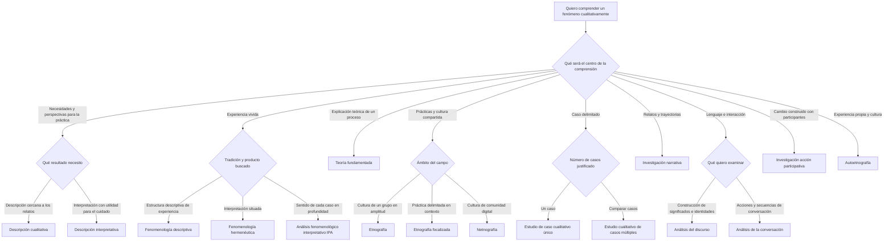

# Brújula de investigación en salud

Propuesta de contenido y reglas para una herramienta educativa. Versión 3: recorridos con metodologías terminales, 3 de octubre de 2026.

## Propósito

Ayudar a estudiantes de ciencias de la salud a formular una pregunta clara, distinguir la investigación con datos propios de la revisión de literatura y justificar opciones metodológicas. La recomendación es una orientación argumentada: puede haber más de un diseño adecuado.

## Mensaje inicial para el estudiante

«Comienza con lo que necesitas saber. Te ayudaremos a precisar tu pregunta y a explorar cómo responderla. Puedes volver atrás y cambiar tus decisiones».

«Un marco de pregunta organiza sus componentes. Un diseño de investigación define cómo producirás o reunirás evidencia. Las entrevistas y los cuestionarios son técnicas de recogida de datos; el análisis temático es un método de análisis. Estos niveles se relacionan, pero no son equivalentes».

## Inicio común

1. Escribe el problema que observas, a quién afecta y por qué necesitas investigarlo. No incluyas información identificable de pacientes.
2. Escribe una pregunta provisional. Si aún no tienes una, describe qué necesitas comprender.
3. ¿De dónde obtendrás la evidencia?
   - Datos que recogeré o analizaré directamente: ruta A. Incluye entrevistas, observaciones, encuestas y registros clínicos existentes.
   - Estudios y documentos publicados: ruta B.
   - Ambas fuentes: completa ambas rutas; una revisión previa no convierte por sí sola el estudio en métodos mixtos.
   - No lo sé: muestra ejemplos de ambas rutas y permite elegir sin asignar un resultado definitivo.
4. ¿Qué necesitas conocer principalmente? Efectos; asociaciones; frecuencia; experiencias y significados; procesos o prácticas; evidencia disponible; combinación de objetivos.

## Árbol general

```mermaid
flowchart TD
    IN[Problema y pregunta provisional] --> FU{Fuente principal de evidencia}
    FU -->|Datos propios o registros| A{Propósito del estudio}
    FU -->|Literatura| B{Propósito de la revisión}
    FU -->|Ambas| AB[Completar las dos rutas]
    AB --> A
    AB --> B
    A -->|Cualitativo| AQ{Producto buscado}
    AQ -->|Descripción aplicada| QD[Estudio cualitativo descriptivo]
    AQ -->|Interpretación para el cuidado| QI[Descripción interpretativa]
    AQ -->|Experiencia vivida| QF{Tradición de comprensión}
    QF -->|Descriptiva| FD[Fenomenología descriptiva]
    QF -->|Hermenéutica| FH[Fenomenología hermenéutica]
    QF -->|Idiográfica e interpretativa| FI[Análisis fenomenológico interpretativo IPA]
    AQ -->|Teoría de un proceso| QT[Teoría fundamentada]
    AQ -->|Cultura y prácticas| QE[Etnografía]
    AQ -->|Caso delimitado| QC[Estudio de caso cualitativo]
    AQ -->|Relatos| QN[Investigación narrativa]
    AQ -->|Cambio participativo| QP[Investigación acción participativa]
    AQ -->|Lenguaje e identidades| QL[Estudio cualitativo de análisis del discurso]
    AQ -->|Interacción natural| QV[Estudio de análisis de la conversación]
    AQ -->|Experiencia propia y cultura| QA[Autoetnografía]
    A -->|Efectos de intervención| AI{Asignación de intervención}
    AI -->|Aleatoria| EA[Ensayo controlado aleatorizado]
    AI -->|No aleatoria con control y pre-post| EC[Estudio cuasiexperimental controlado antes-después]
    AI -->|No aleatoria con mediciones temporales suficientes| ES[Serie temporal interrumpida]
    AI -->|Un grupo con medición pre-post| EU[Estudio antes-después no controlado]
    AI -->|No asignada por investigador| AE{Selección y temporalidad}
    A -->|Exposición y asociación| AE
    AE -->|Exposición y seguimiento futuro| CP[Cohorte prospectiva]
    AE -->|Exposición y seguimiento reconstruido| CR[Cohorte retrospectiva]
    AE -->|Selección por desenlace| CC[Estudio de casos y controles]
    AE -->|Medición en un corte| TA[Estudio transversal analítico]
    A -->|Frecuencia| AF{Casos existentes o nuevos}
    AF -->|Casos existentes| TD[Estudio transversal descriptivo de prevalencia]
    AF -->|Casos nuevos con seguimiento futuro| CI[Estudio de cohorte prospectiva de incidencia]
    AF -->|Casos nuevos con seguimiento reconstruido| CIR[Estudio de cohorte retrospectiva de incidencia]
    A -->|Integración cualitativa y cuantitativa| AM{Orden de integración}
    AM -->|Cuantitativo primero| ME[Diseño mixto secuencial explicativo]
    AM -->|Cualitativo primero| MX[Diseño mixto secuencial exploratorio]
    AM -->|Ambos en paralelo| MC[Diseño mixto convergente]
    B -->|Efectos| BI[Revisión sistemática de intervenciones]
    B -->|Exposición y asociación| BE[Revisión sistemática de etiología y riesgo]
    B -->|Frecuencia| BF{Casos existentes o nuevos}
    BF -->|Casos existentes| BFP[Revisión sistemática de prevalencia]
    BF -->|Casos nuevos| BFI[Revisión sistemática de incidencia]
    B -->|Mapear evidencia| BC[Revisión de alcance]
    B -->|Experiencias y significados| BQ{Propósito de síntesis cualitativa}
    BQ -->|Agregar hallazgos para la práctica| BA[Revisión sistemática cualitativa con metaagregación]
    BQ -->|Desarrollar temas| BT[Revisión sistemática cualitativa con síntesis temática]
    BQ -->|Traducir conceptos| BN[Metaetnografía]
    BQ -->|Usar y revisar un marco| BH[Síntesis cualitativa por marcos]
    B -->|Implementación y contexto| BX{Resultado explicativo buscado}
    BX -->|Experiencias de implementación| BQ
    BX -->|Contexto mecanismo y resultado| BR[Revisión realista]
    B -->|Supuestos de la literatura| BK[Síntesis interpretativa crítica]
    B -->|Tradiciones de investigación| BD[Revisión metanarrativa]
    B -->|Integrar cualitativo y cuantitativo| BM{Relación entre las preguntas}
    BM -->|Misma pregunta y transformación justificada| BMA[Revisión sistemática de métodos mixtos con síntesis convergente integrada]
    BM -->|Dimensiones complementarias| BMS[Revisión sistemática de métodos mixtos con síntesis convergente segregada]
```

## Ruta A: investigación con datos propios

### A1. Experiencias, significados y prácticas

Marco inicial sugerido: **PICo**, adaptado como ayuda para formular la pregunta. Su recomendación formal por JBI corresponde a revisiones cualitativas; utilizarlo en un estudio primario no selecciona ni valida su metodología.

Pregunta al estudiante: «¿Qué tipo de comprensión quieres construir?».

| Respuesta | Opción que conviene explorar | Decisión que falta |
|---|---|---|
| Describir perspectivas, necesidades o barreras para informar la práctica | Estudio cualitativo descriptivo | Definir alcance, muestreo y método de análisis congruente |
| Comprender la experiencia vivida y sus significados | Fenomenología | Precisar tradición descriptiva o interpretativa y supuestos |
| Construir una explicación teórica de un proceso | Teoría fundamentada | Prever análisis y recogida iterativos y muestreo teórico |
| Comprender prácticas y significados compartidos de un grupo | Etnografía | Valorar acceso al campo, observación y tiempo de inmersión |
| Comprender en profundidad un servicio, programa o situación delimitada | Estudio de caso | Delimitar el caso y reunir fuentes complementarias; puede ser cualitativo o mixto |
| Comprender relatos y trayectorias a lo largo del tiempo | Investigación narrativa | Justificar cómo se analizarán relatos, temporalidad y contexto |
| Producir cambios junto con participantes mediante ciclos de reflexión y acción | Investigación acción participativa | Acordar participación real en decisiones y ciclos de acción |
| Interpretar patrones de experiencia para producir conocimiento útil para el cuidado | Descripción interpretativa | Explicitar la perspectiva disciplinar y la utilidad clínica buscada |
| Comprender una práctica concreta dentro de una cultura profesional o servicio | Etnografía focalizada | Delimitar la práctica y combinar observación contextual con otras fuentes |
| Examinar cómo el lenguaje construye identidades, responsabilidades o versiones de la enfermedad | Enfoques de análisis del discurso | Elegir tradición discursiva y corpus; no limitarse a resumir opiniones |
| Comprender cómo se realiza una acción en la interacción clínica | Análisis de la conversación | Acceder a interacciones naturales grabadas y analizar su secuencia |
| Relacionar la experiencia propia del investigador con la cultura del cuidado | Autoetnografía | Justificar la reflexividad y proteger a terceros implicados |

### A1.1. Árbol cualitativo ampliado

Las siguientes preguntas constituyen una secuencia de exploración; las opciones pueden combinarse si se justifica su congruencia. El tiempo, el enfoque crítico y las técnicas son decisiones transversales, no casillas excluyentes.

Las comprobaciones de supuestos, datos, análisis, viabilidad y decisiones transversales se realizan antes de confirmar el resultado. No se añaden como hojas posteriores: cada hoja del árbol conserva el nombre de una metodología puntual. «No sé» mantiene el recorrido abierto con ayuda contextual, sin convertirse en un resultado metodológico.

### A1.2. Fichas ampliadas con ejemplos de salud

| Opción | Qué permite comprender | Ejemplo de pregunta | Datos y condiciones habituales |
|---|---|---|---|
| Descripción cualitativa | Perspectivas y necesidades con una interpretación próxima a lo expresado | ¿Qué necesidades de información describen los familiares al alta de cuidados intensivos? | Entrevistas, grupos focales o documentos; precisar análisis descriptivo, sin suponer ausencia de interpretación |
| Descripción interpretativa | Patrones y diferencias que aporten comprensión para la práctica profesional | ¿Cómo interpretan las enfermeras las necesidades de apoyo para el autocuidado en diabetes? | Entrevistas y observación, entre otras fuentes; partir de una perspectiva disciplinar explícita y desarrollar interpretación aplicada |
| Fenomenología descriptiva | La estructura o significado de la experiencia vivida desde una tradición descriptiva | ¿Cómo se vive la dependencia de oxígeno domiciliario? | Relatos detallados y un método fenomenológico justificado; examinar presupuestos del investigador |
| Fenomenología hermenéutica | La experiencia situada y su interpretación | ¿Qué significado adquiere el cuidado al final de la vida para familiares en su contexto cotidiano? | Relatos y contexto; explicitar la tradición hermenéutica y el papel interpretativo del investigador |
| Teoría fundamentada | Una explicación teórica del proceso estudiado | ¿Cómo construyen los pacientes estrategias para incorporar la hemodiálisis a su vida diaria? | Recogida y análisis iterativos, comparación constante y muestreo teórico; precisar variante metodológica |
| Etnografía | Prácticas, creencias y normas compartidas en su contexto | ¿Cómo se aprende y reproduce la cultura de seguridad en un servicio de urgencias? | Trabajo de campo, observación, entrevistas y documentos; no reducir la cultura a testimonios aislados |
| Etnografía focalizada | Una práctica o problema delimitado dentro de un contexto cultural | ¿Cómo se realiza y se entiende el relevo de enfermería en una unidad de cuidados intensivos? | Observación focalizada y fuentes complementarias; delimitar el campo sin perder el contexto |
| Estudio de caso | Una unidad delimitada en profundidad | ¿Cómo se implementó un programa de atención paliativa en un hospital durante su primer año? | Delimitar unidad, lugar y periodo; integrar fuentes; distinguir caso único de casos múltiples |
| Investigación narrativa | Cómo las personas organizan y dan sentido a sus historias | ¿Cómo narran las mujeres su trayectoria desde el diagnóstico hasta la recuperación del cáncer de mama? | Entrevistas narrativas, diarios o relatos; conservar secuencia, forma y contexto de la historia |
| Análisis del discurso | Cómo el lenguaje produce significados e identidades | ¿Cómo se construye la responsabilidad del paciente en los materiales educativos sobre obesidad? | Textos o interacciones; explicitar tradición y relación entre lenguaje y contexto |
| Análisis de la conversación | Cómo se realizan acciones a través de turnos e intercambios | ¿Cómo se ofrecen y aceptan las opciones terapéuticas durante consultas de oncología? | Grabaciones de consultas naturales y transcripción detallada; atender turnos, pausas y secuencias |
| Investigación acción participativa | Comprensión y transformación con quienes viven el problema | ¿Cómo pueden pacientes y profesionales transformar juntos las barreras de acceso a un centro de salud? | Decisiones compartidas y ciclos de acción y reflexión; consultar participantes no basta para declarar participación |
| Autoetnografía | La conexión entre experiencia personal y mundo social | ¿Cómo se relaciona mi experiencia como residente con la cultura de trabajo y cuidado del servicio? | Registros personales y análisis cultural reflexivo; no equivale a una autobiografía sin análisis |

**Análisis fenomenológico interpretativo (IPA)**: ofrecerlo como opción específica para explorar cómo personas concretas dan sentido a experiencias relevantes. Tiene un compromiso idiográfico: analizar cada caso en profundidad antes de explorar relaciones entre casos. No es sinónimo de toda fenomenología hermenéutica. Ejemplo: «¿Cómo dan sentido a su diagnóstico adultos jóvenes que viven con una enfermedad rara?».

### A1.3. Decisiones transversales

- **Cambio en el tiempo:** si importa cómo se transforma la experiencia, explorar un diseño cualitativo longitudinal con encuentros repetidos y análisis de continuidad y cambio. Un relato retrospectivo de una trayectoria no equivale a seguimiento longitudinal.
- **Poder, desigualdad y exclusión:** explorar perspectivas críticas, feministas o decoloniales cuando estén justificadas por la pregunta y la posición del equipo. No son técnicas de entrevista ni etiquetas que se añaden al final. Pueden informar etnografía, investigación narrativa u otros enfoques congruentes.
- **Comunidades digitales:** considerar etnografía digital o netnografía si se estudian prácticas y cultura de una comunidad en línea; analizar publicaciones como documentos es otra posibilidad. No asignar netnografía únicamente porque los datos proceden de internet.
- **Participación:** distinguir personas consultadas, colaboradoras y participantes que comparten decisiones de investigación. Especificar quién define el problema, interpreta y decide acciones.

Preguntas de confirmación: «¿Qué constituirá un hallazgo útil?», «¿Qué datos permitirían sostenerlo?», «¿Cómo influye tu posición en la interpretación?», «¿Necesitas observar prácticas, además de preguntar por ellas?» y «¿Tienes acceso y tiempo para desarrollar ese enfoque?».

### A1.4. Elegir análisis y recogida de datos

Ofrecer este nivel después de explorar el enfoque. Los métodos no son intercambiables de manera automática.

| Necesidad analítica | Método para explorar | Distinción que se enseñará |
|---|---|---|
| Interpretar patrones de significado en un conjunto de datos | Análisis temático reflexivo | Los temas se desarrollan mediante interpretación y reflexividad; no exigir acuerdo entre codificadores como criterio universal |
| Organizar y comparar casos mediante categorías y matrices | Método de análisis por marcos, Framework Method | Puede combinar categorías iniciales y emergentes; una matriz no sustituye la interpretación |
| Desarrollar categorías del contenido de relatos o documentos | Análisis cualitativo de contenido | Explicitar si las categorías proceden de los datos o de teoría; no reducirlo a contar palabras |
| Comprender forma, secuencia y sentido de historias | Análisis narrativo | Mantener la historia y la temporalidad, en vez de fragmentarla únicamente en temas |
| Examinar construcción de significados mediante lenguaje | Análisis del discurso, según tradición | Puede constituir un enfoque de investigación además de un análisis; exige supuestos coherentes |
| Examinar acciones realizadas en intercambios naturales | Análisis de la conversación | Requiere atención secuencial; una entrevista sobre la consulta no sustituye la consulta grabada |

Técnicas disponibles: entrevistas en profundidad o semiestructuradas; entrevistas narrativas; grupos focales; observación participante o no participante; diarios; análisis de documentos; elicitación con fotografías y técnicas participativas como fotovoz. Cada técnica debe justificarse por lo que permite conocer. Fotovoz incluye interpretación y participación alrededor de imágenes; no consiste solo en pedir fotografías.

La herramienta no fijará un número universal de entrevistas ni usará «saturación» como requisito para todas las tradiciones. Pedirá justificar adecuación de los datos, alcance, profundidad y criterio de cierre en relación con el enfoque elegido.

Estas correspondencias son reglas pedagógicas propuestas, no un algoritmo validado. No recomendar fenomenología por usar la palabra «experiencia», teoría fundamentada por preguntar «cómo» ni etnografía por estudiar una comunidad. Confirmar objetivo, perspectiva teórica, acceso y análisis antes de elegir.

Ejemplo PICo: «¿Cómo viven las personas con enfermedad renal crónica el inicio de la hemodiálisis en centros de atención de una ciudad?».

- P: personas con enfermedad renal crónica que inician hemodiálisis.
- I: experiencia del inicio del tratamiento.
- Co: centros de atención de la ciudad delimitada.

### A2. Efectos de una intervención

Sugerir **PICO**. Preguntar: «¿El equipo investigador asignará la intervención?».

- Sí, con asignación aleatoria y grupo comparador: **ensayo controlado aleatorizado**.
- Sí, sin aleatorización, con grupo comparador y mediciones antes y después: **estudio cuasiexperimental controlado antes-después**.
- Sí, sin aleatorización, con una serie suficiente de mediciones antes y después y momento de intervención definido: **serie temporal interrumpida**.
- Sí, con medición antes y después en un solo grupo: **estudio antes-después no controlado**, explicitando su débil capacidad para atribuir cambios a la intervención.
- No: continuar por A3 hasta seleccionar **cohorte prospectiva**, **cohorte retrospectiva**, **casos y controles** o **transversal analítico**, según selección y temporalidad; considerar confusión y límites para atribuir causalidad.

No asignar automáticamente un ensayo por identificar una intervención. Precisar desenlace, comparador, seguimiento y viabilidad.

### A3. Exposiciones y asociaciones

Sugerir **PEO**; usar **PECO** cuando hay un comparador explícito. Preguntar por temporalidad y selección de participantes.

- Partir de exposición y seguir desenlaces hacia el futuro: **estudio de cohorte prospectiva**.
- Reconstruir exposición y seguimiento ya ocurridos mediante registros adecuados: **estudio de cohorte retrospectiva**. Usar registros existentes no basta para que un estudio sea una cohorte.
- Seleccionar personas según presencia o ausencia del desenlace y estudiar exposición previa: **estudio de casos y controles**.
- Medir exposición y desenlace en un corte: **estudio transversal analítico**, con limitaciones para establecer temporalidad.

Ejemplo: «¿Qué asociación existe entre trabajo nocturno y calidad del sueño en personal de enfermería?».

### A4. Frecuencia

Precisar población, condición, lugar y periodo; no forzar un acrónimo. Distinguir prevalencia de incidencia. La incidencia requiere identificar nuevos casos y definir población en riesgo y tiempo de observación.

- Frecuencia de casos existentes en un corte: **estudio transversal descriptivo de prevalencia**.
- Nuevos casos durante seguimiento futuro: **estudio de cohorte prospectiva de incidencia**.
- Nuevos casos reconstruidos a partir de registros con población en riesgo y tiempo observables: **estudio de cohorte retrospectiva de incidencia**.

### A5. Métodos mixtos

Preguntar: «¿Qué comprenderás al integrar los resultados que no podrías comprender con un solo enfoque?».

- Medir primero y después explicar resultados con datos cualitativos: explorar diseño secuencial explicativo.
- Explorar primero y después desarrollar o estudiar cuantitativamente lo encontrado: explorar diseño secuencial exploratorio.
- Recoger ambos componentes en periodos similares y contrastarlos: explorar diseño convergente.

Exigir un propósito y un punto de integración. Incluir preguntas abiertas en una encuesta no basta para clasificar el estudio como mixto.

## Ruta B: revisión de literatura

### B0. Decisiones hasta una metodología terminal

| Decisión completa | Metodología terminal | Marco que acompaña |
|---|---|---|
| Sintetizar efectos de intervenciones con búsqueda y selección sistemáticas | Revisión sistemática de intervenciones | PICO |
| Sintetizar asociaciones entre exposición y desenlace | Revisión sistemática de etiología y riesgo | PEO o PECO |
| Sintetizar frecuencia de casos existentes | Revisión sistemática de prevalencia | Población, condición y contexto |
| Sintetizar frecuencia de casos nuevos | Revisión sistemática de incidencia | Población en riesgo, condición y tiempo |
| Mapear conceptos, fuentes y vacíos | Revisión de alcance | PCC |
| Agregar hallazgos cualitativos para orientar la práctica | Revisión sistemática cualitativa con metaagregación | PICo |
| Construir temas a partir de hallazgos cualitativos | Revisión sistemática cualitativa con síntesis temática | PICo o SPIDER |
| Traducir conceptos entre estudios y construir una interpretación | Metaetnografía | PICo |
| Sintetizar usando un marco conceptual pertinente que se revisará con la evidencia | Síntesis cualitativa por marcos | PICo o PerSPEcTiF |
| Cuestionar supuestos y construir una explicación conceptual de la literatura | Síntesis interpretativa crítica | Pregunta conceptual iterativa |
| Reconstruir y comparar distintas tradiciones de investigación | Revisión metanarrativa | Pregunta sobre tradiciones y conceptos |
| Explicar relaciones entre contexto, mecanismo y resultado | Revisión realista | Pregunta explicativa contextual |
| Integrar evidencia cualitativa y cuantitativa sobre la misma pregunta mediante transformación justificada de datos | Revisión sistemática de métodos mixtos con síntesis convergente integrada | Pregunta integrada |
| Sintetizar dimensiones cualitativas y cuantitativas por separado y después integrarlas | Revisión sistemática de métodos mixtos con síntesis convergente segregada | Preguntas complementarias, por ejemplo PICO y PICo |

Esta tabla y los árboles definen las salidas. La tabla siguiente agrupa entradas y no sustituye las decisiones de segundo nivel. El metaanálisis se decide dentro de la revisión sistemática por compatibilidad clínica, metodológica y estadística; no es un diseño que se elija solo porque los estudios contienen números.

**Si «textos» significa documentos como datos primarios:** preguntar si se busca sintetizar investigaciones previas o analizar directamente políticas, historias, folletos y otros documentos. La segunda opción regresa a la ruta cualitativa: puede terminar en **estudio cualitativo descriptivo con análisis documental y análisis cualitativo de contenido** o **estudio cualitativo de análisis del discurso**, según el objetivo. Una fuente textual no convierte automáticamente el trabajo en revisión de literatura.

| Propósito | Marco inicial | Orientación metodológica |
|---|---|---|
| Estimar efectos de intervenciones | PICO | Revisión sistemática de intervenciones; metaanálisis solo si los datos y su compatibilidad lo permiten |
| Examinar asociaciones entre exposiciones y desenlaces | PEO o PECO | Revisión sistemática de etiología o riesgo |
| Comprender experiencias, percepciones y significados | PICo | Síntesis de evidencia cualitativa |
| Mapear conceptos, tipos de evidencia y vacíos | PCC | Revisión de alcance |
| Comprender implementación según perspectiva, entorno y momento | PICo; PerSPEcTiF como ampliación | Precisar si se requiere síntesis cualitativa u otro enfoque de síntesis contextual |
| Integrar evidencia cuantitativa y cualitativa | Preguntas complementarias, por ejemplo PICO y PICo | Revisión de métodos mixtos con estrategia explícita de integración |

Una pregunta amplia no determina por sí sola una revisión de alcance. Una revisión de alcance puede incluir estudios cualitativos, cuantitativos y otras fuentes; no es exclusivamente cualitativa.

Para una síntesis cualitativa, ofrecer un segundo nivel:

- Reunir hallazgos para orientar la práctica: explorar metaagregación.
- Construir temas descriptivos y, cuando corresponda, analíticos entre estudios: explorar síntesis temática.
- Traducir e interpretar conceptos entre estudios: explorar metaetnografía.
- Organizar hallazgos mediante un marco conceptual y revisarlo con los datos: explorar síntesis por marcos; distinguir variantes como best-fit framework synthesis.
- Cuestionar supuestos de la literatura y construir una explicación conceptual: explorar síntesis interpretativa crítica, con búsqueda y selección iterativas justificadas.
- Comprender cómo distintas tradiciones han definido e investigado un problema: explorar revisión metanarrativa.

Las dos últimas opciones pueden incorporar evidencia cualitativa, cuantitativa y mixta; no son exclusivamente cualitativas. Como ruta avanzada relacionada, una síntesis realista pregunta qué funciona, para quién y en qué circunstancias, examinando relaciones entre contexto, mecanismo y resultado. Tampoco es exclusivamente cualitativa ni demuestra eficacia solo por explicar mecanismos.

Ejemplos de decisión:

| Necesidad de la revisión | Opción para explorar | Pregunta de confirmación |
|---|---|---|
| Reunir hallazgos de experiencias para orientar el cuidado | Metaagregación | ¿Buscas recomendaciones sustentadas en hallazgos agregados? |
| Construir temas entre estudios sobre barreras de acceso | Síntesis temática | ¿Buscas temas descriptivos y posiblemente una interpretación analítica? |
| Construir una interpretación nueva de conceptos sobre vivir con dolor | Metaetnografía | ¿Los estudios aportan conceptos suficientemente ricos para traducirlos entre sí? |
| Examinar barreras mediante un modelo de implementación | Síntesis por marcos | ¿Hay un marco pertinente y permitirás hallazgos que no encajen en él? |
| Revisar críticamente cómo se define la vulnerabilidad en salud | Síntesis interpretativa crítica | ¿Necesitas examinar supuestos y construir una explicación teórica? |
| Comparar tradiciones que investigan la adherencia terapéutica | Revisión metanarrativa | ¿Las diferencias entre tradiciones son parte central de la pregunta? |

«Metasíntesis» es un término amplio: pedir que el estudiante especifique el método concreto. «Síntesis narrativa» no es sinónimo de investigación narrativa ni convierte automáticamente una revisión en síntesis cualitativa.

La elección depende también de la riqueza de los hallazgos disponibles, la perspectiva teórica, el propósito y la experiencia del equipo. No confundir análisis temático de entrevistas propias con síntesis temática de estudios publicados.

## Fichas de los marcos

### PICO

**P**: población. **I**: intervención. **C**: comparación. **O**: desenlace.

Plantilla: «En [P], ¿qué efecto tiene [I], comparada con [C], sobre [O]?».

Ejemplo: «En adultos con hipertensión, ¿qué efecto tiene un programa de seguimiento por enfermería, comparado con atención habitual, sobre la presión arterial?».

Mensaje: «Encaja cuando quieres estudiar efectos. Define cómo medirás el desenlace. Si el tiempo es central, puedes explicitarlo como PICOT».

### PEO y PECO

**P**: población. **E**: exposición. **O**: desenlace o resultado de interés. **C**, en PECO: comparación.

Plantilla de asociación: «En [P], ¿qué relación existe entre [E] y [O]?».

Plantilla de experiencia: «¿Cómo perciben [P] [O] en relación con [E]?».

Ejemplo cualitativo: «¿Cómo perciben las personas hospitalizadas el apoyo recibido durante el aislamiento?».

Mensaje: «PEO tiene usos diferentes según la guía y el propósito. No implica automáticamente investigación cualitativa. Si quieres comprender significados y el contexto es central, compara tu formulación con PICo».

### PICo

**P**: población o participantes. **I**: fenómeno de interés. **Co**: contexto.

Plantilla: «¿Cómo experimentan o interpretan [P] [I] en [Co]?».

Ejemplo: «¿Cómo experimentan los cuidadores familiares el cuidado de personas con demencia en el hogar?».

Mensaje: «El fenómeno es lo que buscas comprender. No necesitas inventar un grupo de comparación ni convertir la experiencia en un desenlace numérico». Mantener visible la diferencia entre PICO y PICo.

### SPIDER

**S — Sample**: muestra o participantes. **PI — Phenomenon of Interest**: fenómeno de interés. **D — Design**: diseño y formas de recogida de datos consideradas en la propuesta original. **E — Evaluation**: experiencias, percepciones o aspectos evaluados. **R — Research type**: investigación cualitativa o mixta.

Ejemplo para una revisión sobre cuidadores: S, cuidadores familiares de personas con demencia; PI, cuidado en el hogar; D, estudios con entrevistas u observación; E, experiencias y necesidades de apoyo; R, cualitativos y componentes cualitativos de estudios mixtos.

Mensaje: «SPIDER ayuda a delimitar la evidencia que buscarás. El componente D no decide tu metodología. Completar todos los componentes no obliga a incluirlos todos en una búsqueda: demasiadas restricciones pueden dejar fuera estudios relevantes».

### PCC

**P**: población. **C**: concepto. **C**: contexto.

Plantilla: «¿Qué evidencia existe sobre [concepto] en [población], dentro de [contexto]?».

Ejemplo: «¿Qué evidencia existe sobre necesidades de apoyo de cuidadores de personas con demencia en atención domiciliaria?».

Mensaje: «Encaja con el objetivo de mapear evidencia. No permite concluir por sí solo cuál intervención es más efectiva».

### Opciones avanzadas

**SPICE**: entorno, perspectiva, intervención, comparación y evaluación. Considerarlo para preguntas de evaluación de servicios que necesitan precisar para quién y dónde funciona una actuación. No presentarlo como exclusivamente cualitativo.

**PerSPEcTiF**: perspectiva, entorno, fenómeno de interés o problema, ambiente más amplio, comparación opcional, tiempo o momento y hallazgos. Considerarlo cuando las condiciones contextuales y la implementación requieren mayor detalle. Distinguir el entorno inmediato del ambiente social, organizacional o político más amplio.

No añadir estos marcos al recorrido inicial: mostrarlos cuando aporten componentes necesarios.

## Resultado que recibirá el estudiante

1. Tu pregunta provisional y una reformulación editable.
2. Tu ruta: estudio primario, revisión o dos recorridos complementarios.
3. Marco sugerido y componentes completados.
4. Razón de la sugerencia, vinculada a sus respuestas.
5. Una metodología principal con nombre puntual, justificada por las respuestas. Mostrar una alternativa solo explicando qué decisión tendría que cambiar para seleccionarla.
6. Decisiones pendientes: alcance, acceso, tiempo, recursos, supuestos y análisis.
7. Próximo paso concreto y fuentes para ampliar.

Ejemplo de salida:

> Metodología sugerida: **estudio cualitativo descriptivo**. Elegiste describir necesidades de apoyo de cuidadores para orientar la práctica y mantener el análisis próximo a sus relatos. PICo organiza tu pregunta; las entrevistas semiestructuradas permiten producir datos y el análisis cualitativo de contenido inductivo es una opción congruente para desarrollar categorías. Si el objetivo cambia hacia una interpretación disciplinar de patrones para el cuidado, vuelve a la decisión de producto esperado y considera descripción interpretativa. La planificación de muestreo y acceso complementa esta elección.

## Reglas para implementar posteriormente

- Usar respuestas explícitas; no clasificar solo por palabras de la pregunta.
- Cada recorrido completo debe terminar en una metodología puntual. PICO, PICo, SPIDER, «cualitativo», «cuantitativo», «revisión de textos», «precisar contexto» y «consultar al tutor» no son resultados terminales.
- Una hoja puede incluir el método de síntesis cuando sea necesario para precisar la revisión: por ejemplo, revisión sistemática cualitativa con síntesis temática.
- Si faltan decisiones indispensables, continuar preguntando; no inventar una respuesta para forzar una metodología. Las respuestas incompatibles vuelven al nodo pertinente.
- Permitir «no sé» y ofrecer ejemplos sin asignar una metodología definitiva.
- Si el objetivo y las respuestas se contradicen, mostrar qué necesita aclararse.
- No ofrecer puntuaciones de certeza ni porcentajes sin validación.
- Mostrar una orientación principal y una alternativa cuando exista una diferencia relevante.
- Separar siempre marco, diseño, recogida de datos y análisis.
- Para cualitativos, recoger unidad de interés, producto esperado, perspectiva teórica, temporalidad, participación y acceso al campo antes de emitir la orientación.
- Mostrar opciones avanzadas cuando las respuestas las justifiquen, junto con sus exigencias; no recomendar el enfoque con menos tiempo como si fuera metodológicamente superior.
- No asociar automáticamente cualitativo descriptivo con principiante ni enfoques interpretativos con mayor calidad. La calidad depende de la congruencia y ejecución.
- Para datos propios, incluir revisión ética, consentimiento cuando corresponda, protección de datos y acceso como decisiones de planificación.
- Para revisiones, precisar protocolo, criterios de inclusión, búsqueda, selección, evaluación metodológica y síntesis según el tipo de revisión.
- Aclarar que PRISMA es una guía de reporte y GRADE-CERQual evalúa confianza en hallazgos de síntesis cualitativas; ninguno es un diseño de investigación.
- Si se incluyen estudios mixtos en una síntesis cualitativa, comprobar que se pueden identificar y extraer sus hallazgos cualitativos.

## Casos para revisión docente

| Pregunta | Ruta esperada | Error que la herramienta debe evitar |
|---|---|---|
| ¿Cómo viven los pacientes el inicio de hemodiálisis? Entrevistas propias | Datos propios, cualitativa, PICo | Asignar fenomenología automáticamente |
| ¿Qué experiencias reportan los estudios sobre hemodiálisis? | Revisión, PICo; SPIDER para delimitar evidencia | Recomendar entrevistas propias |
| ¿El seguimiento por enfermería reduce la presión arterial? | Efectos, PICO | Elegir ensayo sin conocer asignación y viabilidad |
| ¿Se asocia trabajo nocturno con alteraciones del sueño? | Asociación, PEO o PECO | Clasificar como cualitativo por usar PEO |
| ¿Qué conceptos y medidas de carga del cuidador se han investigado? | Mapeo, PCC | Asumir revisión de efectividad |
| ¿Cómo se negocian las decisiones de cuidado dentro de un equipo? | Datos propios cualitativos; precisar teoría, prácticas o caso | Elegir teoría fundamentada solo por «cómo» |
| ¿Qué proporción presenta agotamiento y cómo explica sus condiciones laborales? | Explorar métodos mixtos | Omitir la integración entre componentes |
| ¿Cómo se presenta la responsabilidad del paciente en folletos de obesidad? | Discurso; explicitar corpus y tradición | Limitarse a contar términos |
| ¿Cómo se negocia el consentimiento durante consultas grabadas? | Análisis de la conversación | Sustituir secuencias reales por opiniones sobre la consulta |
| ¿Cómo cambia la experiencia de autocuidado durante un año? | Diseño cualitativo longitudinal y enfoque congruente | Confundir seguimiento con una única entrevista retrospectiva |
| ¿Cómo interpretar necesidades de apoyo para orientar el cuidado de enfermería? | Comparar descripción cualitativa e interpretativa | Presentarlas como sinónimos |
| ¿Cómo se han investigado las distintas concepciones de adherencia? | Explorar revisión metanarrativa | Confundirla con investigación narrativa primaria |

### Comprobación de recorridos completos

| Respuestas de un recorrido | Salida terminal esperada |
|---|---|
| Datos propios; describir necesidades; interpretación próxima al relato | Estudio cualitativo descriptivo |
| Datos propios; experiencia vivida; comprensión hermenéutica situada | Fenomenología hermenéutica |
| Datos propios; cultura profesional; práctica delimitada observada en contexto | Etnografía focalizada |
| Datos propios; caso delimitado; comparación entre hospitales | Estudio cualitativo de casos múltiples |
| Datos propios; intervención asignada aleatoriamente; comparador | Ensayo controlado aleatorizado |
| Datos propios; intervención no aleatoria; control; mediciones pre-post | Estudio cuasiexperimental controlado antes-después |
| Registros; asociación; exposición y seguimiento reconstruidos | Estudio de cohorte retrospectiva |
| Datos propios; exposición y desenlace en un corte | Estudio transversal analítico |
| Datos propios; frecuencia de casos existentes en un corte | Estudio transversal descriptivo de prevalencia |
| Literatura; experiencias; construir temas entre estudios | Revisión sistemática cualitativa con síntesis temática |
| Literatura; implementación; contexto, mecanismo y resultado | Revisión realista |
| Literatura; mapear evidencia y vacíos | Revisión de alcance |
| Documentos como corpus primario; construcción de identidades mediante lenguaje | Estudio cualitativo de análisis del discurso |

Criterio de aceptación del árbol: ningún nodo sin conexiones salientes puede ser un marco de pregunta, una categoría general o una tarea pendiente. Las entradas incompletas permanecen en nodos de decisión. Los recorridos completos muestran una metodología, su justificación y las condiciones necesarias para llevarla a cabo.

Esta versión requiere revisión docente del contenido y pruebas de comprensión con estudiantes antes de presentarla como instrumento validado.

## Fuentes y alcance de la evidencia

Las fuentes fundamentan las definiciones y distinciones. El recorrido, los textos y las reglas de recomendación son una propuesta pedagógica elaborada para esta herramienta.

1. [JBI: PICo y pregunta de revisión cualitativa](https://jbi-global.atlassian.net/wiki/spaces/MANUAL/pages/863895732/3.3.7+Determining+the+review+question).
2. [Cooke, Smith y Booth, 2012: propuesta original de SPIDER](https://pubmed.ncbi.nlm.nih.gov/22829486/).
3. [JBI: PCC y alineación de preguntas y criterios de revisiones de alcance](https://jbi-global.atlassian.net/wiki/spaces/MANUAL/pages/355862707/10.2.4+Developing+and+aligning+the+eligibility+criteria+with+the+objective+s+and+question+s).
4. [Morgan y colaboradores, 2018: PECO para exposición y desenlaces](https://pmc.ncbi.nlm.nih.gov/articles/PMC6908441/).
5. [Booth y colaboradores, 2019: PerSPEcTiF y preguntas sobre intervenciones complejas](https://pmc.ncbi.nlm.nih.gov/articles/PMC6350737/).
6. [Cochrane: manual de síntesis de evidencia cualitativa](https://www.cochrane.org/authors/handbooks-and-manuals/cochrane-campbell-handbook-qualitative-evidence-synthesis).
7. [Cochrane: evidencia cualitativa, capítulo 21](https://www.cochrane.org/authors/handbooks-and-manuals/handbook/current/chapter-21).
8. [Choosing a Qualitative Research Approach: congruencia entre pregunta y enfoque](https://pmc.ncbi.nlm.nih.gov/articles/PMC4675428/).
9. [Estudio metodológico sobre componentes de búsqueda cualitativa y recuperación](https://pmc.ncbi.nlm.nih.gov/articles/PMC8485961/).
10. [Thorne, Kirkham y MacDonald-Emes: descripción interpretativa](https://pubmed.ncbi.nlm.nih.gov/9100747/).
11. [Gale y colaboradores: Framework Method en investigación en salud](https://pmc.ncbi.nlm.nih.gov/articles/PMC3848812/).
12. [Braun y Clarke: recursos y diferencias del análisis temático reflexivo](https://www.thematicanalysis.net/understanding-ta/).
13. [Cochrane: revisión metanarrativa, síntesis interpretativa crítica y metaagregación](https://training.cochrane.org/cochrane-campbell-handbook-qualitative-evidence-synthesis/qeschapter19v0110425).
14. [Etnografía focalizada en educación médica: orientaciones metodológicas](https://pmc.ncbi.nlm.nih.gov/articles/PMC6567138/).
15. [Descripción cualitativa en investigación en salud](https://pmc.ncbi.nlm.nih.gov/articles/PMC5703087/).
16. [BMJ: análisis del discurso](https://doi.org/10.1136/bmj.a879).
17. [SAGE: autoetnografía y relación entre experiencia personal y cultura](https://methods.sagepub.com/ency/edvol/embed/sage-encyc-qualitative-research-methods/chpt/autoethnography).
18. [Braun y Clarke: comparación de análisis temático y otros enfoques analíticos](https://doi.org/10.1002/capr.12360).
